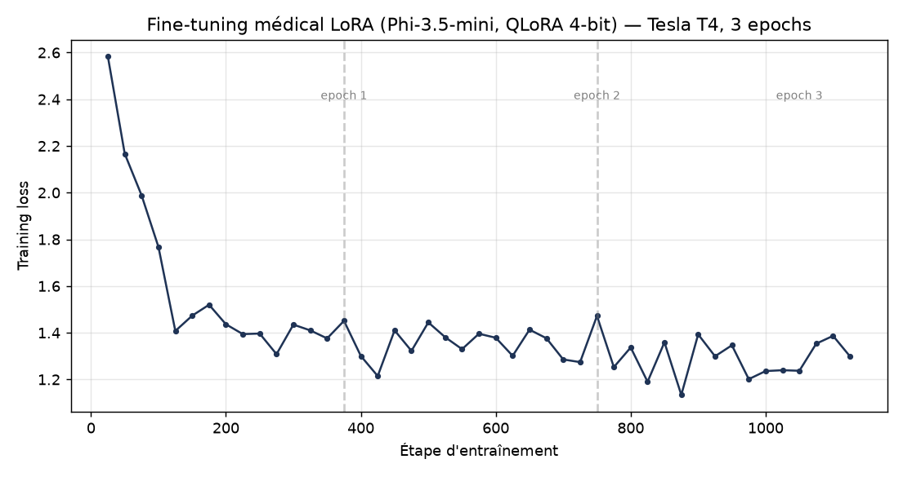

# Métriques d'entraînement — fine-tuning médical LoRA (Colab T4)

Run **complet** exécuté sur Google Colab (GPU Tesla T4) à partir de `medical_finetuning_colab.ipynb`.

- **Modèle de base :** microsoft/Phi-3.5-mini-instruct (4-bit NF4)
- **Méthode :** QLoRA, r=16, alpha=32, dropout 0.05
- **Dataset :** ruslanmv/ai-medical-chatbot (256 916 conversations, 3 000 échantillonnées)
- **Config :** 3 epochs, batch 2 × grad. accum. 4 (batch effectif 8), lr=2e-4, `paged_adamw_8bit`,
  `max_length=512`, gradient checkpointing

## Métriques finales

| Métrique | Valeur |
|---|---|
| Épochs | 3 |
| Étapes | 1 125 |
| `train_runtime` | 10 994,68 s (~3 h 03) |
| `train_samples_per_second` | 0,819 |
| Loss moyenne (`train_loss`) | 1,415 |
| Loss initiale (étape 25) | 2,583 |
| Loss finale (étape 1125) | 1,299 |

## Courbe de loss

La loss chute fortement pendant la première epoch (2,58 → ~1,4) puis se stabilise et descend
lentement vers ~1,3 sur les epochs 2 et 3. L'adaptateur LoRA a convergé proprement sur le corpus
médical.

## Test conversationnel (section 9 du notebook)

Réponses réelles du modèle fine-tuné après entraînement :

> **Q : What are common symptoms of dehydration?**
> A : *Dehydration is a condition that occurs when your body loses more water than it takes in. It
> can happen due to excessive sweating, vomiting or diarrhea… signs you may have become dehydrated:
> 1) Thirsty feeling… 2) Dry skin, especially around fingers/nails, dry lips…*

> **Q : Is a persistent headache with fever something to worry about?**
> A : *Hello. I have gone through your query and can understand that you are worried because of the
> symptoms, which is quite normal in such cases…*

Le modèle adopte bien le registre d'un assistant médical conversationnel. Il reste **expérimental**
et n'est **pas** destiné à un usage clinique ou à la production.

> Le notebook versionné propose par défaut une config plus légère (800 échantillons, 1 epoch) pour
> un run reproductible en moins de 15 minutes sur T4.
